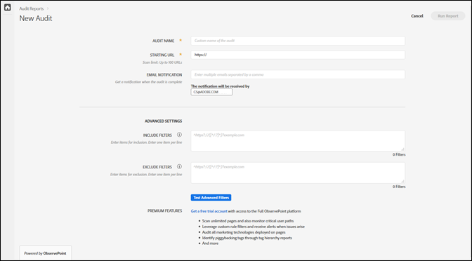
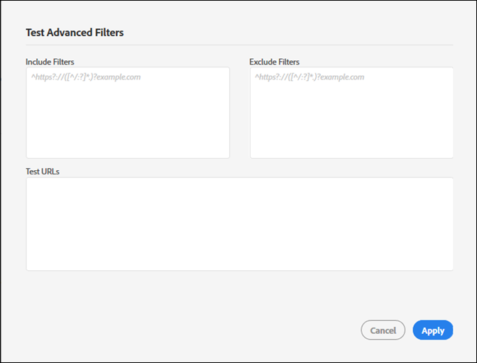

# Criar uma nova auditoria {#create-a-new-audit}

>[!NOTE]
>
>Os usuários estão limitados a uma auditoria executada de cada vez. Ocorre um erro se você tentar iniciar uma auditoria com as mesmas configurações que a que está sendo executada. Você pode usar o link na mensagem de erro se desejar cancelar a auditoria em execução no momento para criar um novo link.

Se desejar, use o link na parte inferior da página para acessar uma conta de avaliação gratuita e com recursos completos com o ObservePoint.

1. Na lista Auditor, clique em **[!UICONTROL New Audit]**.

   A tela [!DNL New Audit] se abre.

   

1. (Obrigatório) Nomeie a auditoria.

   O nome pode ter até 250 caracteres.
1. (Obrigatório) Especifique o URL inicial.

   O protocolo é necessário ao especificar o URL inicial. O URL inicial é a página na qual a auditoria começa a rastrear. Depois de iniciado, o Adobe Experience Platform Auditor rastreia até 500 páginas, seguindo os links que começam no URL inicial. Consulte [Incluir e excluir filtros](../create-audit/filters.md) para obter mais informações. O URL inicial pode ter até 250 caracteres.

   >[!NOTE]
   >
   >Em alguns casos, pode levar até 48 horas para concluir uma verificação de 500 páginas.

1. Especifique um ou mais endereços de e-mail para notificações sobre esta auditoria.

   Você pode especificar vários e-mails ao separá-los com uma vírgula. O solicitante é notificado por padrão. Os endereços de e-mail são validados em tempo real. Se você digitar um endereço inválido, seu nome será notificado na tela.

   Cada e-mail tem no máximo 250 caracteres, incluindo o fim do domínio (por exemplo, .com).

1. Especifique [!UICONTROL Incluir filtros].

   Esse campo pode conter URLs exatos, URLs parciais ou expressões regulares. Use este campo para os critérios que deseja que cada URL corresponda. Todos os URLs rastreados que não correspondem aos critérios de [!UICONTROL Incluir filtro] não são incluídos nos resultados da auditoria.

   Você pode inserir diretórios que deseja que a auditoria verifique. Ou você pode executar auditoria entre domínios ou de automatização, onde é necessário iniciar a auditoria em um domínio e terminar em outro. Para fazer isso, digite os domínios que deseja navegar; para padrões complexos de URL, use uma expressão regular.

   >[!NOTE]
   >
   >Se você incluir uma página em seus filtros, mas ela não estiver conectada ao URL inicial, ou o Platform Auditor verificar 500 páginas antes de chegar a essa página, a página não será digitalizada e não será incluída nos resultados do teste.

   Os filtros de inclusão são limitados a 1.000 caracteres por linha.

   Consulte [Incluir lista](../create-audit/filters.md) para obter mais informações.
1. Especifique Excluir filtros.

   A [!UICONTROL Lista de exclusões] impede que os URLs sejam auditados. Use URLs exatos, URLs parciais ou expressões regulares, como faria na [!UICONTROL Lista de inclusão].

   Uma prática comum é excluir um link de logout se a auditoria tiver uma sessão de usuário (por exemplo: `/logout`, ou seja, qualquer URL que contenha a string `/logout`).

   Os filtros de exclusão são limitados a 1.000 caracteres por linha.

   Consulte [Excluir lista](../create-audit/filters.md) para obter mais informações.
1. (Opcional) Se desejar, você pode testar os filtros incluir e excluir e testar seus URLs.

   Insira os filtros e URLs e clique em **[!UICONTROL Apply]** para executar o teste.

   

1. Clique em **[!UICONTROL Run Report]**.
