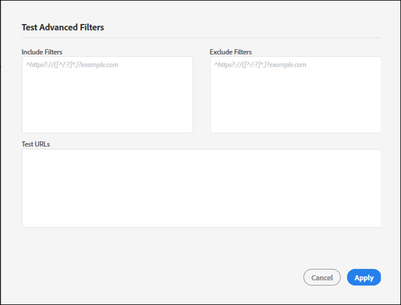

# Incluir e excluir filtros {#include-and-exclude-filters}

Incluir filtros que restringem os links que uma auditoria pode rastrear a partir do URL inicial. Excluir filtros impedem que uma auditoria arraste links.

<!--
Content from ObservePoint (https://help.observepoint.com/articles/2872121-include-and-exclude-filters) with their permission. Modified slightly for style and Auditor emphasis.
-->

Incluir filtros e Excluir filtros fornecem diretrizes para auditorias. Deixando os filtros Incluir e Excluir vazios, uma auditoria pode rastrear todos os links que encontrar, começando pelos links no URL inicial.


Ao aplicar Incluir filtros, Excluir filtros ou uma combinação de ambos, as instruções relacionadas aos links que uma auditoria pode rastrear podem ser fornecidas.

Qualquer item no campo [!UICONTROL Incluir filtros] restringe a verificação somente às páginas que correspondem a esse item. Qualquer item em um campo [!UICONTROL Excluir filtros] impede que qualquer página que corresponda a esse item seja digitalizada.

Os filtros Incluir e Excluir podem ser URLs completos, URLs parciais ou expressões regulares que correspondam a uma página válida.

## Ordem de precedência {#section-e9d42419dd3f459bb20e7a33c6104f12}

1. O **URL inicial** tem prioridade sobre tudo o resto e sempre será visitado durante uma auditoria, mesmo se um URL corresponder a um item nos filtros Excluir. O URL inicial é sempre visitado antes de qualquer outro URL.

   

   Na imagem acima, uma auditoria descobre links da `document.links` propriedade da página inicial. Estas ligações podem ser examinadas pela auditoria.

1. **Incluir URLs** deve ser vinculado a partir de uma página inicial, caso contrário, eles não poderão ser detectados e não serão visitados.

   

   Na imagem acima, adicionar um filtro Incluir restringe os URLs elegíveis àqueles que correspondem ao filtro. Agora, apenas cinco links podem ser digitalizados pela auditoria.

1. **Excluir URLs** elimina links da qualificação.

   

   Na imagem acima, a adição de um filtro Excluir impede que os URLs dos links elegíveis. Agora, apenas três links podem ser digitalizados pela auditoria.

## URL inicial {#section-ccb46abcd96f4a8ab171245015d2b724}

O Adobe Experience Platform Auditor exige uma única página para o URL inicial. O URL inicial é sempre visitado antes de qualquer outro URL. Quaisquer links descobertos na página inicial são elegíveis para visita, sujeitos aos filtros Incluir e Excluir. Se um item Excluir corresponder a um URL inicial, ele será ignorado.

## Incluir filtros {#section-7626060a56a24b658f8c05f031ac3f5f}

Os filtros Incluir limitam quais links são elegíveis para serem digitalizados durante uma auditoria. Incluir filtros pode ser:

* URLs totalmente qualificados
* URL parcial
* Expressões regulares correspondentes a URLs completos ou parciais
* Qualquer combinação das

Adicionar URLs ou expressões regulares ao filtro Incluir não garante que esses URLs específicos sejam verificados na auditoria. A auditoria inspeciona os links no URL inicial e, em seguida, navega pelos links elegíveis. A auditoria continua esse processo de inspeção e navegação até que o limite de 500 URLs digitalizados seja atingido ou até que não sejam encontrados mais links elegíveis.

>[!NOTE]
>
>Em alguns casos, pode levar até 48 horas para concluir uma verificação de 500 páginas.

Por padrão, uma auditoria verificará todos os subdomínios do URL inicial. A menos que seja explicitamente substituído pelo fornecimento de um filtro Incluir, a verificação usará o seguinte filtro de inclusão regex:

`^https?://([^/:\?]*\.)?mysite.com`

Isso torna qualquer link encontrado na página Iniciando URL elegível para visita. Corresponde a qualquer página em qualquer subdomínio do URL inicial.

O uso do filtro Incluir padrão fornece um intervalo amplo para que uma auditoria seja rastreada. Para entrar em determinadas seções ou páginas, forneça instruções específicas para sua auditoria adicionando filtros nesta caixa. Nesse caso, substitua o valor padrão pelos diretórios que você deseja que a auditoria verifique. Você também pode usar filtros Incluir para executar auditoria entre domínios, onde é necessário iniciar a auditoria em um domínio e terminar em outro. Para fazer isso, digite os domínios que deseja atravessar. Em qualquer caso, para que os URLs do filtro Incluir sejam encontrados, eles devem ser descobertos em uma página auditada.

Os filtros Incluir podem conter URLs exatos, URLs parciais ou expressões regulares. Por exemplo, se o URL inicial for [!DNL http://mysite.com], as seguintes páginas poderão ser digitalizadas por padrão (observe os caracteres em negrito):

```html
http://mysite.com
http
<b>s</b>://mysite.com
http://
<b>www</b>.mysite.com/home
http://
<b>dev</b>.mysite.com/home
http://
<b>my</b>.mysite.com/products/products_and_services.html
```

Para padrões complexos de URL, use o [testador de expressão regular do ObservePoint.](https://regex.observepoint.com/)

## Excluir filtros {#section-00aa5e10c878473b91ba0844bebe7ca9}

Os filtros Excluir impedem que os URLs sejam auditados. Você pode usar URLs exatos, URLs parciais ou expressões regulares. Nenhum URL que corresponda a um item nos filtros Excluir é visitado. Se o URL inicial estiver incluído nos filtros Excluir, ele não será excluído. O URL inicial é sempre verificado por uma auditoria.

## Testando filtros e URLs {#section-3cfa125b1756411395a64701e128efa0}

Você pode testar os filtros e URLs no Platform Auditor.

Ao criar sua auditoria, clique em **[!UICONTROL Test Advanced Filters]**. Insira seus filtros e URLs e clique em **[!UICONTROL Apply]**.



## Documentação do ObservePoint {#section-79cdc8e850d047969b6d2badf6bbd6f9}

Este artigo foi desenvolvido em cooperação com a ObservePoint. Para obter as informações mais recentes, consulte a [documentação do ObservePoint](https://help.observepoint.com/).
