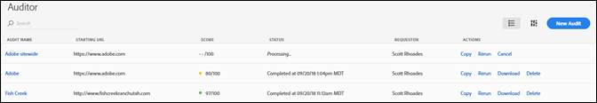
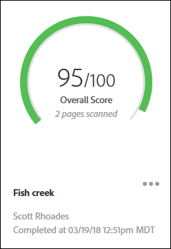
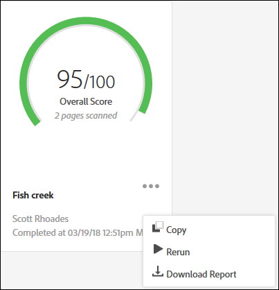

# Página Lista de auditoria {#audit-list-page}

A página Lista de auditoria mostra informações sobre todas as suas auditorias.

Quando você start o Adobe Experience Platform Auditor, a página Lista de auditoria é exibida. Você pode exibir a página Lista de auditoria como uma lista ou exibição de cartão.

## Exibição em lista {#section-a428749d2ab94a08bf460e6a486b844a}

A exibição em Lista exibe as seguintes informações para cada auditoria.

| Item | Descrição |
|---|---|
| Nome da auditoria | O nome dado à auditoria |
| URL inicial | O URL no qual a auditoria começa a rastrear suas páginas |
| Pontuação | As auditorias têm pontuação de 1 a 100, o que significa 100 que não há problemas nas páginas digitalizadas |
| Status | Mostra quando a auditoria foi concluída ou que está sendo processada |
| Solicitante | Mostra o nome do usuário que criou a auditoria |
| Ações | Provides links for copying or rerunning the audit, canceling an audit that is currently running, downloading a report as an [!DNL Excel] spreadsheet, or deleting the audit |

Clique no nome da auditoria para ver os resultados da auditoria.

## Exibição de cartão {#section-6826b585e53a46daa722b9bd3eda926e}

A exibição de cartão mostra cada auditoria em um formato gráfico.

Clique no nome da auditoria para ver os resultados da auditoria. Click the menu next to the name to see links for copying, rerunning, or canceling the audit, or to download a finished report as an [!DNL Excel] spreadsheet or PDF.

