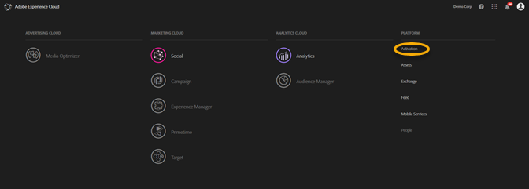
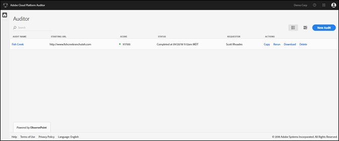
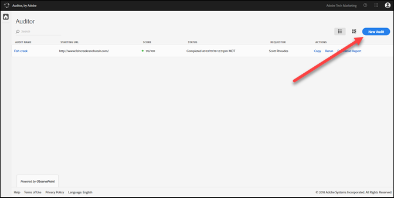
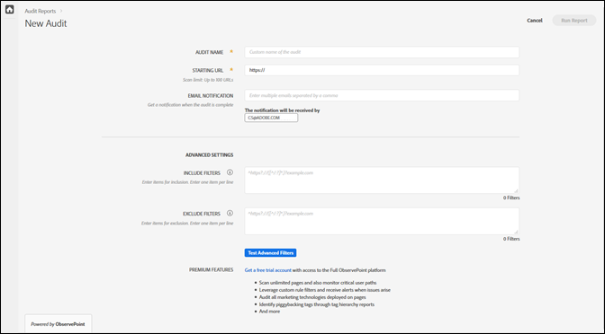
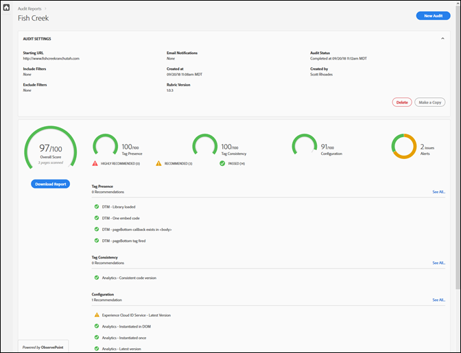

# Introdução {#getting-started}

## Introdução {#task-1024e94b5948413295c9698e62165a04}

<!--
This page is a placeholder for now, we need things like prerequisites, any planning that should be done before using Auditor, initial setup info--that kind of thing.
-->

Na primeira vez que utilizar o Auditor, deverá concluir e aceitar o acordo do Auditor. O Auditor foi desenvolvido como um esforço cooperativo entre a Adobe e o ObservePoint. Os usuários do Auditor podem usar a funcionalidade Limitada do ObservePoint sem custo adicional. Para usar o Auditor, você deve aceitar as comunicações do ObservePoint.

## Execução da primeira verificação {#task-b211597afed343cfa238443fcf7c6041}

1. Clique no botão de menu no canto superior direito da barra de navegação da Adobe Experience Cloud e clique em **[!UICONTROL Ativação]**.

   

1. Selecione Auditor e aceite os Termos de Uso.

   A página Auditor fornece um painel de verificações anteriores, juntamente com a opção de executar uma nova verificação.

   

1. Clique em **[!UICONTROL Nova auditoria]**.

   Para executar uma nova verificação, clique em **[!UICONTROL Nova auditoria]** no canto superior direito da tela.

   

1. Configure a verificação.

   Nomeie a auditoria, forneça um URL inicial e clique em **[!UICONTROL Executar relatório]**. Após a conclusão da verificação, você receberá uma notificação por e-mail.

   

   Para obter uma descrição de todas as opções de configuração, consulte [Criar uma nova auditoria](../create-audit/create-new-audit.md#task-6d157f80e5264642b877c2820b1d077d).
1. Exibir seu relatório.

   Quando você receber o e-mail informando que a verificação foi concluída, clique no link para [exibir seu relatório](../reports/scorecard.md#concept-8958a64346c34f74844553dda1ccf869) e começar a entender oportunidades para melhorar sua implementação e obter mais valor das soluções da Adobe.

   Você também pode clicar no nome da auditoria na [página Auditor](../get-started/audit-list.md) para ver o status da auditoria e exibir o relatório após a conclusão da auditoria.

   
