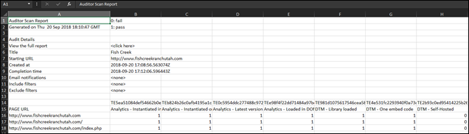

# Download report{#download-report}

O relatório mostra se cada URL passa ou falha.

O relatório pode ser exibido na página do Scorecard na interface do usuário. Você também pode baixar o relatório:

1. Na lista Auditor ou em uma tabela de resultados, clique em **[!UICONTROL Baixar relatório]**.

   É possível baixar o relatório como uma planilha ou um arquivo PDF.
1. Especifique se deseja abrir ou salvar o arquivo.

1. Clique em **[!UICONTROL OK]**.

   A planilha mostra se cada teste foi bem-sucedido ou falhou em cada página.

   

O PDF mostra as seguintes informações:

* Configurações para a auditoria
* Carimbo de data e hora de conclusão
* Pontuação geral
* Pontuação por categoria
* Testes de unidade aplicados com URLs que falharam
* Link do Recommendations e do documento de ajuda por teste
