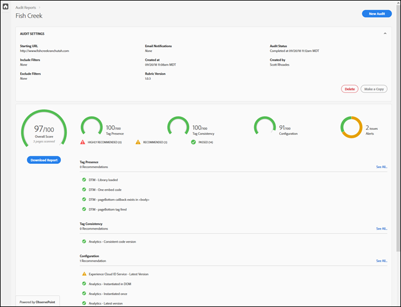
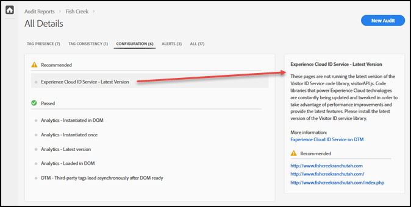

# Scorecard {#scorecard}

Depois de executar um teste, o scorecard mostra informações sobre uma auditoria.

Clique no nome da sua auditoria na página do Auditor para ver os resultados do seu teste.

Use o scorecard para ver como a auditoria foi pontuada nas seguintes categorias:

* Pontuação geral
* Presença de tag

   Avalia se a tag existe e se está no local certo no código da página.
* Consistência de tags

   Avalia se as tags são consistentes entre URLs.
* Configuração

   Avalia as tags em relação a outras regras e práticas recomendadas.
* Alerta

   Os alertas mostram problemas que você deve estar ciente, mas que não afetam sua pontuação.

Sua pontuação depende do peso de cada teste e se você for aprovado ou reprovado. Se você passar, sua pontuação aumenta em um número de pontos igual ao peso do teste.

* 0: Alerta sobre problemas que você deve estar ciente, mas que não afetam sua pontuação.
* 1: Recomenda uma otimização. Nenhum impacto na precisão dos dados.
* 2: Se esse teste falhar, você não terá acesso aos recursos e correções mais recentes na Adobe Experience Cloud.
* 3: Testes de eficiência e se a implementação segue práticas recomendadas.
* 4: Falha significa que você pode estar coletando dados não confiáveis.
* 5: Falha significa que você pode ver perda de dados.

O scorecard lista quaisquer problemas de nível 4 ou 5 como **altamente recomendado** que você corrija.

O scorecard lista todos os problemas de nível 1 a 3 conforme **recomendado** para você corrigir.

Clique em **[!UICONTROL Baixar o relatório]** para baixar um arquivo Excel ou PDF contendo as informações relatadas pela auditoria.

Além da pontuação para cada categoria, o scorecard lista quaisquer correções recomendadas ou altamente recomendadas, bem como os itens que passaram no teste. Clique em cada edição para ver mais detalhes na caixa à direita. Clique novamente para detalhar e ver recomendações de como corrigir o problema. A seguir estão os detalhes de uma edição Recomendada na tabela de indicadores mostrada acima:

Clique nas categorias na parte superior da tela para ver os problemas encontrados em cada categoria.

## Quais páginas faziam parte do teste? {#section-fd38ffeb868648e89c34c5772fa65f46}

Você pode exibir listas dos URLS que passaram ou que falharam no teste.

No Scorecard, clique em um nome de teste ou no link **[!UICONTROL Ver todos]** sob cada cabeçalho de categoria. Isto leva-vos aos detalhes dos testes. Para cada teste, você pode ver a descrição do teste e uma lista de todos os urls que falharam e foram aprovados. Essas informações também estão incluídas nos relatórios baixados.
